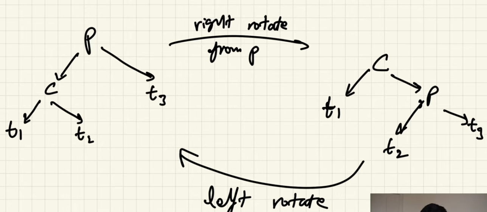

# Basics :)

### Perfect Binary Tree
1. Total nodes in a perfect binary tree is = 2^(h+1) - 1
2. Total number of leaf nodes is = 2^h
3. 
   

### Binary Search Tree
1. BST is a simple binary tree implementation where every node can have at most 2 child node
2. we will store sorted data in bst and all the greater values will be on right side of parent node 
   and all the less values will be on left side.
3. for a balanced bst the height of the tree is O(log n)
4. and the insertion and search is O(log n)
5. but if bst is not balanced then the operation will take more time.

example :)  

10
  - 9
     - 8
       - 7
  

### To avoid this unbalanced problem with bst we can use self balanced binary search tree
1. AVL Tree
   - AVL tree is self balanced bst 
   - how it works
      1. Insert normally as bst
      2. start from node n ( last node that is inserted ) and find the nodes that is makes tree unbalanced.
      3. sol the subtree which is unbalanced
      4. we can rotate the subtree ( right rotate or left rotate)

   

### sol of AVL tree
  we can balance bst by there 4 rules
  1. left-left 
      - rotate right from P (parent) node
  
  2. left-right
      - rotate left from C (child) node
      - rotate right from P (parent) node

  3. right-right 
      - rotate left from P (parent) node

  4. right-left
      - rotate right from C (child) node
      - rotate left from P (parent) node

